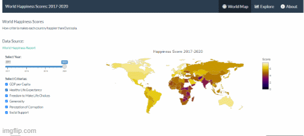

# ShinyDashboard-WorldHappiness

This is my capstone project for Data Visualization Interactive Plotting. From the visual, it was really helpful to see the rankings across the world and how they played against our own perceived assumptions of the happiest countries in the world. We check the correlation between variables that make up the Happiness Score, in the correlation visual we found out that it have strong correlations between Happiness and Economy..GDP.per.Capita, Health..Life.Expectancy (life expectancy),and Social support (Family). High scores among these categories speak to the likelihood of having a high overall Happiness Score. The variable that look like interesting is between Generosity and Corruption this two variable have a lowest point at this analysis, 0,10024 for generosity and 0,42801 for corruption. It is a bigger concern, it means generosity didn't effect to much for the happiness and Governments should be worried by the corruption scores which had very poor scores across the globe.

Link : https://rachma.shinyapps.io/worldhappiness/

## Dependencies

This time we try to get acquainted with R Shiny, what is R Shiny? Shiny is a package in R that allows users to build interactive web apps. Shiny combines the computational power of R statistics and its interaction with the modern web. Shiny consists of 3 components : 
1. User Interface (ui) : is a function that defines the web appearance of our application. Its function contains all inputs and outputs that will be displayed in the app.
2. Servers (servers) : is a function that defines the web appearance of our application. Its function contains all inputs and outputs that will be displayed in the app.
3. ShinyApp (shinyapp) : is a function of the application that calls the UI and Server to run the application

## Sources

Data Collecting from: [World Happiness Report](https://worldhappiness.report/) The World Happiness Report is a publication of the Sustainable Development Solutions Network, powered by data from the Gallup World Poll and Lloyd’s Register Foundation who provided access to the World Risk Poll. The scores are from nationally representative samples, and take the data between the years 2017-2020. The Happiness Score is primarily driven by six factors — economic (GDP per capita), social support, healthy life expectancy, freedom, corruption, and generosity. Each of these factors contribute to making life evaluations higher in each country than they are in Dystopia .

